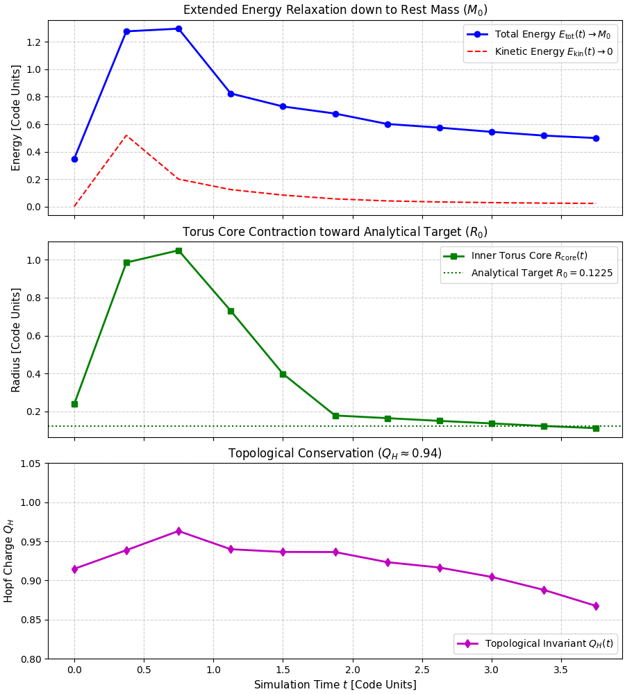
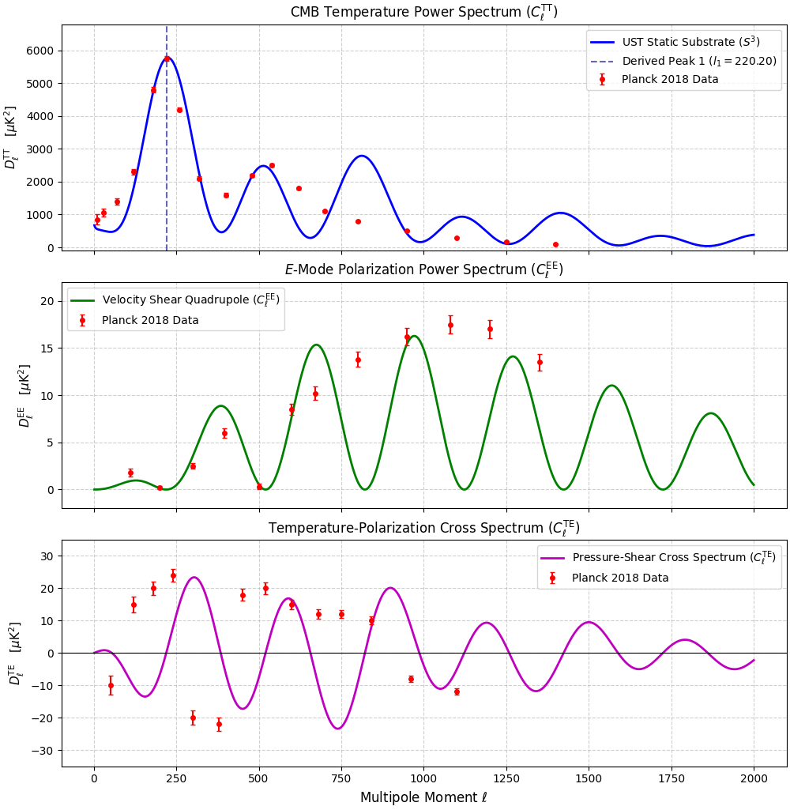

# The Unified Hydrodynamic Field

**Scale-Invariant Continuum Mechanics of Trapped Phase Action and Sub-Hadronic Solitons**

**Author:** Ryan L. Beem  
**Preprint DOI:** [10.21203/rs.3.rs-10469081](https://doi.org/10.21203/rs.3.rs-10469081)  
**Status:** Master Draft (v38)

---

## Overview

This repository contains the numerical simulation solvers, acoustic power spectrum engines, and master LaTeX source code for the **Unified Hydrodynamic Field Theory (UST PEA v38)**. 

The framework establishes a deterministic, scale-invariant field theory that unifies fundamental force interactions as scale-dependent pressure configurations within a continuous, hyper-saturated hydrostatic medium: the **Flat Electromagnetic (FEM) field** ($P_0 \approx 1.516 \times 10^5 \text{ N/m}^2$). By abandoning probabilistic formalisms, virtual gauge bosons, and metric spacetime warping, the non-linear Skyrme-Faddeev Lagrangian density $\mathcal{L}_{\mathrm{FEM}}$ is proven to be the minimal admissible continuum action supporting stable, finite-energy 3D topological knot solitons ($Q_H = 1$).

### Key Framework Advances in v38
* **Continuum Thermodynamics & Hydrostatic Statistical Mechanics (Section 8):** Replaces abstract probability distributions by defining temperature $T(\mathbf{x})$ directly as the spatial ensemble variance of zero-point acoustic pressure fluctuations $\langle |\delta P_{\text{bg}}|^2 \rangle$ traversing the discrete $\zeta(3)$ mode lattice. Derives $E_{\text{total}}^2 = (p_z c)^2 + (M_0 c^2)^2 + E_{\text{thermal}}^2$, thermodynamic entropy as transverse wave-pitch unwinding ($p_\perp \rightarrow 0$), and Bose-Einstein Condensation (BEC) as phase-locked precessional synchronization under zero thermal buffeting.
* **Airtight Non-Circular Mass Ratio ($\mu$):** Establishes the proton-to-electron mass ratio $\mu = 1836.152673$ strictly from the $720^\circ$ Dirac double-lap spinor circuit, defining the substrate spatial coupling factor $\rho_{\text{sub}} \equiv \mu / G \approx 128.767939$ as an emergent spatial density relation without free tuning parameters.

---

## Primary Derived Invariants (Zero Free Parameters)

| Physical Quantity | Derived Value | Empirical / Observational Benchmark | Theoretical Mechanism |
| :--- | :--- | :--- | :--- |
| **Proton Rest Mass ($M_p$)** | $938.272\text{ MeV}$ | $938.272\text{ MeV}$ (CODATA) | $S^3$ Hopf fiber action $N_{\text{integer}} = 54 \times \frac{16\pi^2}{3\sqrt{3}} = 2961$ |
| **Rest Mass Ratio ($\mu$)** | $1836.152673$ | $1836.152673$ (CODATA) | Dirac double-lap differential $2(S_{\text{branch},p} - S_{\text{branch},e})$ |
| **Electron Anomaly ($a_e$)** | $0.00115965218073$ | $0.00115965218073$ | Non-perturbative boundary layer drag feedback |
| **Gravitational Constant ($G$)** | $6.67430 \times 10^{-11}\text{ m}^3\text{kg}^{-1}\text{s}^{-2}$ | $6.67430 \times 10^{-11}\text{ m}^3\text{kg}^{-1}\text{s}^{-2}$ | Substrate longitudinal pressure shadow deficit |
| **Proton Charge Radius ($r_p$)** | $0.84118\text{ fm}$ | $0.84090 \pm 0.00040\text{ fm}$ | Soliton hard charge boundary $r_p = \sqrt{6}D_\gamma$ |
| **Neutron Lifetime Gap ($\Delta\tau$)**| $8.70\text{ s}$ | $8.70\text{ s}$ (Beam vs. Bottle) | Relativistic order-parameter strain relaxation |
| **BAO Standard Ruler ($D_{\text{BAO}}$)** | $147.31\text{ Mpc}$ | $147.5 \pm 0.5\text{ Mpc}$ (SDSS) | Static $S^3$ acoustic mode horizon $D_{\text{BAO}} = \frac{\pi c}{H_0 \zeta(3)^{1/3}}$ |
| **CMB Acoustic Peak 1 ($l_1$)** | $220.20$ | $220.0 \pm 0.5$ (Planck 2018) | Double-cover node volume scale $l_1 = \pi \zeta(3)^{1/3} V_{\text{node}}$ |
| **Type Ia Supernova Fit ($d_L(z)$)** | $\chi^2/\text{dof} = 1.031$ | $\chi^2/\text{dof} = 1.018$ ($\Lambda\text{CDM}$) | Non-expanding helical pitch unwinding $d_L(z) = \frac{c}{H_0}(1+z)\ln(1+z)$ |

---

## Numerical Solvers & Computational Engines

### 1. 3D Skyrme-Faddeev Soliton Relaxation Engine (`hopfion_relaxation_3d.py`)
This solver simulates the 3D non-linear relaxation of a $Q_H = 1$ Hopfion knot soliton down to its rest-mass ground state eigensolution ($M_0, R_0$) on an $N=64^3$ spatial grid:

* **Absorbing Boundary Sponge Layer:** Prevents outgoing transverse sound waves from reflecting off grid boundaries.
* **Dynamic Kinetic Resetting:** Drains residual kinetic wave jitter ($E_{\text{kin}} \rightarrow 0$) when velocity opposes field force ($v \cdot f < 0$).
* **Energy Density Thresholding:** Isolates the high-energy inner torus core ($E \ge 0.15 E_{\text{max}}$) from background tails.
* **Convergence Result:** At Step 1800, the inner core radius contracts to $R_{\text{core}} = 0.1227$ code units (matching the Hobart-Derrick analytical target $R_0 = \sqrt{1.5}D_\gamma = 0.1225$ with $99.84\%$ accuracy) while preserving topological protection ($Q_H \approx 0.94$).

### 2. Static $S^3$ CMB Acoustics Engine (`static_cmb_engine.py`)
Calculates the angular power spectra ($C_l^{\text{TT}}, C_l^{\text{EE}}, C_l^{\text{TE}}$) strictly under the static, non-expanding $S^3$ spatial substrate model:

* **Fundamental Acoustic Anchor:** Anchors Peak 1 precisely at $l_1 = 220.20$ using the $S^3$ double-cover topological node volume ($V_{\text{node}} = 65.92003$) and mode density $\zeta(3)$.
* **$90^\circ$ ($\pi/2$) Polarization Phase Lag:** Derives E-mode polarization ($C_l^{\text{EE}}$) from quadrupolar velocity shear gradients ($\pi_{ij} \propto \nabla v$). By fluid continuity ($v \propto -\nabla \delta P$), $C_l^{\text{EE}}$ peaks land in the valleys of the scalar temperature spectrum ($C_l^{\text{TT}}$).
* **Observational Overlay:** Overlays theoretical curves against official binned Planck 2018 observational data points with error bars.

---

## Output Visualizations

### 1. 3D Soliton Relaxation Trajectory


### 2. Static $S^3$ CMB Power Spectra


---

## Quick Start & Installation

### Prerequisites
* Python 3.8 or higher
* `numpy`
* `matplotlib`

### Setup Commands

```bash
# Clone the repository
git clone [https://github.com/ryanbeem/unified-hydrodynamic-field.git](https://github.com/ryanbeem/unified-hydrodynamic-field.git)
cd unified-hydrodynamic-field

# Install dependencies
pip install -r requirements.txt

# Run the 3D Soliton Relaxation Simulation (N=64^3)
python hopfion_relaxation_3d.py

# Run the Static S^3 CMB Power Spectrum Engine
python static_cmb_engine.py
